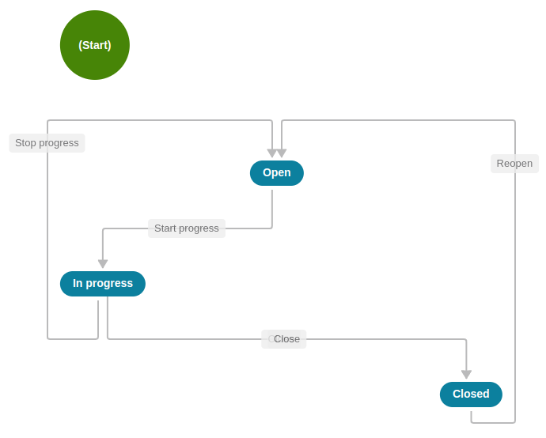

# Quatrix Frontend Interview Challenge

Hi there! Congrats on making it to the take-home portion of our interview process! We aim for this exercise to be enjoyable and brief, and welcome feedback. We also are happy to answer questions, so please don't be shy about reaching out to your point of contact at Quatrix should you find any parts of this challenge unclear or confusing.

## Objective:

Build a task management application using the provided [Task API](#task-api). The app should focus on core task listing, creation, updating, deletion, and managing task status transitions.

## Constraints

Constraints

- **Time Limit:** You have three (3) days to complete this challenge.
- **Version Control:** Use a Git-based repository on GitHub, GitLab, or Bitbucket to host your code.
- **Documentation:** Include a README file in your repository with:
  - Setup instructions (how to run your application locally)
  - A brief explanation of your design choices and any known limitations.

## Technology Stack:

Select **one** (or **two**) of the following:

- React Native (for cross-platform mobile apps)
- Next.js (server-side rendered React for web apps)
- React (client-side rendered React for web apps)

## Requirements

### Task Listing:

- Fetch tasks from the Task API using pagination (`page`, `per_page`).
- Implement a clear pagination control component
- Display tasks in a clear list:
  - Include subject, status, priority, and due date (if applicable).
  - Visually distinguish task statuses (e.g., color-coding).

### Create Task:

- Implement a form for creating new tasks.
- Required fields: subject, priority, description, and optional due date.
- Send a POST request to the Task API to create the task.

### Update Task:

- Allow editing of existing tasks.
- Editable fields: subject, priority, description, and due date.
- Send a PATCH request to the Task API to update the changes.

### Delete Task:

- Implement a confirmation step before deletion.
- Send a DELETE request to the Task API to delete the task.

### Task Flow Management

- Implement buttons for actions based on the current task status, following the transition table and diagram provided.
- After a successful transition, update the task's displayed status dynamically.

**Task State Transition Table**

| Current Status | Available Options                                     | New Status  |
| -------------- | ----------------------------------------------------- | ----------- |
| Open           | Click "Start Progress" to begin working on this task. | In Progress |
|                | Click "Close" to mark the task as completed.          | Closed      |
| In Progress    | Click "Stop Progress" to pause work on this task.     | Open        |
|                | Click "Close" to mark the task as completed.          | Closed      |
| Closed         | Click "Reopen" to resume work on this task.           | Open        |

**Task State Transition Diagram**

## Additional Considerations

- **State Management:** Choose a suitable approach (Redux, Context API, or your preferred library).
- **Error Handling:** Display meaningful error messages for API requests.
- **Visual Design:** Strive for a clean, user-friendly layout.
- **Testing:** While not strictly mandatory for this challenge, some basic tests would be a bonus.

## Evaluation Criteria

- **Code Quality:** Clean, organized structure following best practices for your chosen framework.
- **Functionality:** Task operations execute correctly according to the requirements.
- **API Usage:** Demonstrate proper API endpoint interactions.
- **UI/UX:** User-friendly interface and smooth transitions.
- **Problem-Solving:** Effective solutions for challenges and edge cases.

## Tips

- **Planning:** Sketch out your app's components and how data will flow between them before diving into the code. This will streamline your development process.
- **Documentation:** Reference the [Task API](#task-api) documentation provided.
- **Ask Questions:** We want you to succeed! If anything in the requirements or specifications is unclear, please reach out to your contact for clarification.
- **Focus and Prioritize:** Get the core functionality working first. Then, if time allows, add refinements and additional features.
- **Share Your Progress:** Set up a code repository and share the URL with us. This lets us see your approach and provide guidance if needed.

# Task API

The Task API is organized around REST. Our API has predictable resource-oriented URLs, accepts JSON-encoded request bodies, returns JSON-encoded responses, and uses standard HTTP response codes, and verbs.

## Attributes

| Name          | Type              | Description                                       |
| ------------- | ----------------- | ------------------------------------------------- |
| id            | string            | Unique identifier for the task.                   |
| object        | string            | Represents the object's type (i.e. "task").       |
| task_priority | string            | Priority: `high`, `normal` or `low`.              |
| status_id     | string            | Phase of work: `open`, `in_progress` or `closed`. |
| subject       | string            | Brief title summarizing the task.                 |
| description   | string            | Detailed explanation of the work to be done.      |
| due_date      | string (ISO 8601) | Deadline for task completion.                     |
| created_at    | string (ISO 8601) | Date and time the task was created.               |
| updated_at    | string (ISO 8601) | Date and time the task was last modified.         |

## Base URL

`https://task.quatrixglobal.com/`

## List all tasks

Returns a list of all tasks.

### Resource

`GET /tasks`

### Query parameters

| Name     | Type    | Description               |
| -------- | ------- | ------------------------- |
| page     | integer | Current page number.      |
| per_page | integer | Maximum objects per page. |

### Returns

An object with the following properties:

- `data`: An array of task objects.
- `page`: Current page number.
- `per_page`: Maximum items per page.
- `total`: Total number of task items.

## Retrieve a task

Retrieves a specific task using its ID.

### Resource

`GET /tasks/{task_id}`

### Returns

- Task object (if valid ID is provided)
- Error (if task does not exist)

## Create a task

Creates a new task.

### Resource

`POST /tasks`

### Returns

- The created task object.
- Error (if there's a problem with creation)

## Start a task

Changes the status of an open task to `in_progress`.

### Resource

`POST /tasks/{task_id}/start_progress`

### Returns

Updated task object with new status: `in_progress`
Error (if there's a problem with the update)

## Stop a task

Changes the status of an in-progress task to `open`.

### Resource

`POST /tasks/{task_id}/stop_progress`

### Returns

- Updated task object with new status: `open`
- Error (if there's a problem with the update)

## Close a task

Changes the status of an open or in-progress task to `closed`.

### Resource

`POST /tasks/{task_id}/close`

### Returns

- Updated task object with new status: `closed`
- Error (if there's a problem with the update)

## Reopen a task

Changes the status of a closed task to `open`.

### Resource

`POST /tasks/{task_id}/reopen`

### Returns

- Updated task object with new status: `open`
- Error (if there's a problem with the update)

## Update a task

Modifies an existing task.

### Resource

`PATCH /tasks/{task_id}`

### Returns

- Updated task object (if successful)
- Error (if there's a problem with updates)

## Delete a task

Deletes a specified task.

### Resource

`DELETE /tasks/{task_id}`

### Returns

- Information about the deleted object (if successful)
- Error (if the task can't be deleted)
